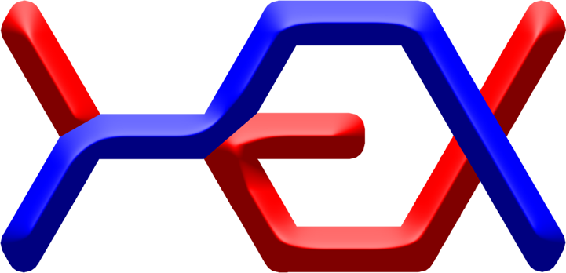
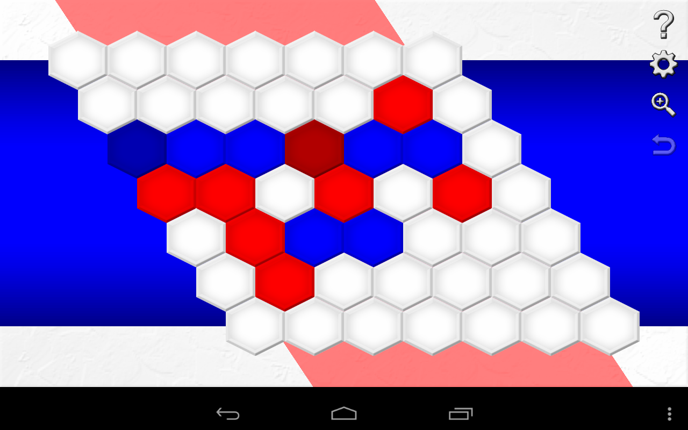

# Hex

This is a game developed for mobile, browser and desktop.

Check the [releases] tab for desktop and mobile versions.

Check the [web version] to play it now in your browser. It's updated more frequently than the desktop and mobile versions.

## More than just a game

Hex is also part of a scientific research project: Math and programming in Hex.

The project had the objective of study and apply analytical geometry (and math, in general), Game Theory and artificial intelligence concepts on game development.

It's a different way to learn those field of study. You can check this [wiki page][wiki] to see for yourself and learn math and programming in an interesting way.

There is also a portuguese pdf made at the end of the scientific research project, check it out [here][pdf].

## Contributing

The game was developed (and being updated from time to time) with [MOAI][moai] and [Lua][lua].

Have a look at the [CONTRIBUTING.md][contributing] file if you would like to contribute in the development.

## Credits

- Development guided by Leandro Fiorini Aurichi
- Project supported by [CNPq][cnpq]
- Developed with [MOAI][moai]
- Builded with [MoaiCLI][moaicli]

## License

[GPLv3][license]

[releases]: https://github.com/luanorlandi/Hex/releases
[web version]: https://luanorlandi.github.io/Hex/
[contributing]: CONTRIBUTING.md
[wiki]: https://github.com/luanorlandi/Hex/wiki
[pdf]: https://github.com/luanorlandi/Hex/blob/master/wiki/Matem%C3%A1tica%20e%20programa%C3%A7%C3%A3o%20em%20Hex.pdf
[moai]: http://moaiforge.com/
[lua]: https://www.lua.org/
[cnpq]: http://cnpq.br/
[moaicli]: http://halfnelson.github.io/moaicli/
[license]: LICENSE
